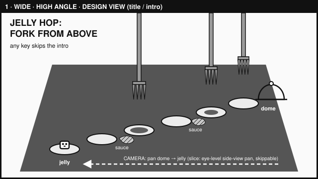
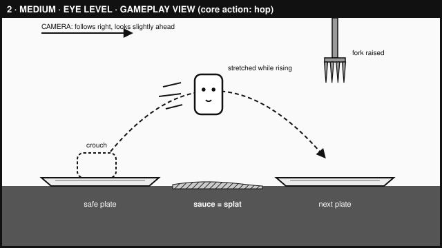
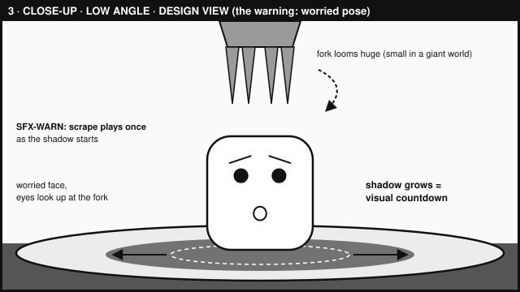
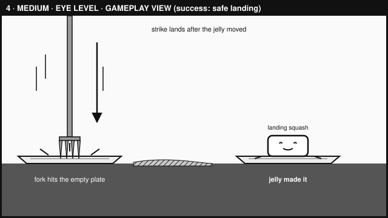
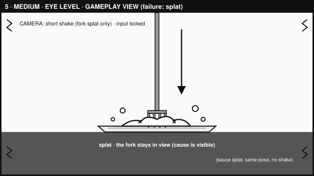
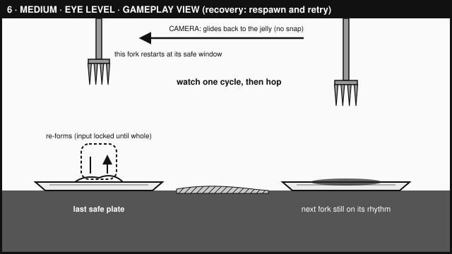
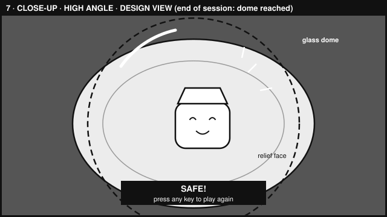

# STORYBOARD — Jelly Hop: Fork From Above

Version 1 · 2026-10-01 · written before image or audio asset generation. Later revisions are added as new dated sections; this version is not rewritten.

- **Frame shape:** 16:9 in every panel.
- **Sketches:** simple boxes-and-labels SVG thumbnails in `design/storyboard/`, drawn by Claude at my request with `tools/make_storyboard_svgs.py`. I specified what they must show and reviewed each one. They are grayscale on purpose because the palette is not set yet.
- **Gameplay view:** what the game camera shows during play (side view, eye level).
- **Design view:** a framing used only to define how a moment should look and feel. Each panel's "In the playable slice?" line says what the slice will actually show.
- Cups are not shown; whether they are platforms is still unresolved.
- SFX-HOP, SFX-LAND, and SFX-SPLAT are planned sound IDs; the final event list is set in CHANGE-BRIEF.md.

## Panel 1 — First thing the player sees

- **Shot:** wide · high angle · design view (title / intro) · motion: the camera pans from the dome back to the jelly
- **In the playable slice?** The slice opens with this journey as an eye-level side-view pan from the dome back to the jelly. The high-angle wide framing is a design view only.
- **Player action:** watches the pan, or presses any key to skip it. Movement is locked during the pan, and the skip key never triggers a hop. Play starts when the pan ends or is skipped.
- **See:** the table, six plates, sauce in some gaps, forks above with shadows on their plates, the dome at the far end, the jelly idle on the first plate, the title, and "any key skips the intro"
- **Hear:** MUS-LOOP starts quieter during the pan, then rises to normal volume when play begins
- **Assets:** ENV-TABLE, ENV-PLATE, ENV-SAUCE, ENV-FORK, ENV-SHADOW, ENV-DOME, CHAR-IDLE, MUS-LOOP
- **Design reason (Small in a giant world):** before taking control, the player sees how tiny the jelly is and how far the dome is.

## Panel 2 — Core action: the hop

- **Shot:** medium · eye level · gameplay view · motion: hop-arc arrow and speed lines; the camera follows right and looks slightly ahead
- **In the playable slice?** Yes, as drawn.
- **Player action:** presses jump; the jelly crouches, stretches as it rises, and arcs toward the next plate
- **See:** crouch, then the stretched rising pose; the safe plate, the sauce gap, the next plate, and a raised fork over the next plate
- **Hear:** SFX-HOP on takeoff; music normal
- **Assets:** CHAR-ANTIC, CHAR-RISE, ENV-TABLE, ENV-PLATE, ENV-SAUCE, ENV-FORK, SFX-HOP, MUS-LOOP
- **Design reason (Wobbly and alive):** the hop should feel squishy and intentional, and the sauce gap shows where a short hop would land.

## Panel 3 — The warning

- **Shot:** close-up · low angle · design view · motion: dashed arrow for the descending fork, outward arrows for the growing shadow
- **In the playable slice?** The moment, yes: the worried pose, the scrape, the growing shadow, and the music dip. The slice shows it at medium, eye level. The close-up low-angle framing is a design view only.
- **Player action:** standing on a plate as its fork's shadow starts; deciding whether to move now, wait, or jump back
- **See:** the worried face looking up, the fork overhead, the shadow spreading across the plate
- **Hear:** SFX-WARN plays once as the shadow starts; the music becomes quieter and muffled while any shadow is growing
- **Assets:** CHAR-WORRY, ENV-TABLE, ENV-PLATE, ENV-FORK, ENV-SHADOW, SFX-WARN, MUS-LOOP
- **Design reason (Read the shadow, then commit):** the scrape draws attention early, then the growing shadow is the visual countdown.

## Panel 4 — Success: safe landing

- **Shot:** medium · eye level · gameplay view · motion: downward strike arrow, speed lines, and impact lines on the plate behind
- **In the playable slice?** Yes, as drawn.
- **Player action:** hopped during the countdown; lands on the next plate as the fork strikes the plate it left
- **See:** the landing squash with a happy face; the fork in the empty plate behind
- **Hear:** SFX-LAND on touchdown; the music fades back to normal after the strike, unless another shadow is growing
- **Assets:** CHAR-LAND, ENV-TABLE, ENV-PLATE, ENV-SAUCE, ENV-FORK, SFX-LAND, MUS-LOOP
- **Design reason (Read the shadow, then commit):** committing at the right time pays off, and the player sees exactly what they avoided.

## Panel 5 — Failure: splat

- **Shot:** medium · eye level · gameplay view · motion: downward strike arrow; a short camera shake on a fork splat only (camera only, never the jelly or collision shapes)
- **In the playable slice?** Yes, as drawn. A sauce splat uses the same splat pose without the shake.
- **Player action:** stayed under the shadow too long, or landed short in sauce. Input is locked through the splat and the re-form; presses or holds during the lock are ignored.
- **See:** the flattened splat with droplets; for a fork splat, the fork stays in view so the cause is visible
- **Hear:** SFX-SPLAT once; the music dips briefly
- **Assets:** CHAR-SPLAT, ENV-TABLE, ENV-PLATE, ENV-FORK, ENV-SAUCE, SFX-SPLAT, MUS-LOOP
- **Design reason (Every splat teaches):** the player should see why they failed and want one more try.

## Panel 6 — Recovery: respawn and retry

- **Shot:** medium · eye level · gameplay view · motion: the camera glides back to the jelly (no snap); upward arrows as the jelly re-forms
- **In the playable slice?** Yes, as drawn.
- **Player action:** waits while the jelly re-forms on the last safe plate. Control returns when the jelly is whole, and the next hop needs a fresh jump press.
- **Respawn safety:** that plate's fork cycle restarts at its safe window, and the safe window begins when control returns. Other plates' forks keep their own rhythm.
- **See:** the jelly re-forming into a cube; the checkpoint fork raised; the next plate's fork and shadow continuing their fixed rhythm
- **Hear:** the music returns to normal on respawn, unless any warning shadow is still growing; then it stays quieter and muffled until none is. No separate respawn sound is planned.
- **Assets:** CHAR-RESPAWN, CHAR-IDLE, ENV-TABLE, ENV-PLATE, ENV-SAUCE, ENV-FORK, ENV-SHADOW, MUS-LOOP
- **Design reason (Every splat teaches):** the fixed rhythms keep going, so the retry is a chance to use what the player just learned.

## Panel 7 — End of session: dome reached

- **Shot:** close-up · high angle · design view (end-of-slice moment) · motion: none, held frame
- **In the playable slice?** The moment, yes: the relief face, SFX-WIN, the music fade, and the prompt, shown in the eye-level gameplay view. The close-up high-angle framing is a design view only.
- **Player action:** reaches the dome; a prompt waits. Any key restarts on the first plate with no intro pan; every fork cycle and checkpoint resets, and the restart key never triggers a hop.
- **See:** the jelly's relief face under the glass dome; "SAFE!" and "press any key to play again"
- **Hear:** SFX-WIN; the music fades out, then quiet; on restart the music starts again
- **Assets:** CHAR-CELEBRATE, ENV-TABLE, ENV-PLATE, ENV-DOME, SFX-WIN, MUS-LOOP
- **Design reason (Wobbly and alive):** the relief face pays off the player's attachment to the jelly.

## Coverage check

| Requirement | Panels |
|-------------|--------|
| First thing the player sees | 1 |
| Core action | 2 |
| Success | 4 |
| Failure | 5 |
| Recovery or retry | 6 |
| End of a play session | 7 |
| Shot sizes: wide · medium · close-up | 1 · 2, 4, 5, 6 · 3, 7 |
| Angles: high · eye level · low | 1, 7 · 2, 4, 5, 6 · 3 |
| Motion indicated | 1, 2, 3, 4, 5, 6 |
| Gameplay views · design views | 2, 4, 5, 6 · 1, 3, 7 |

## Asset IDs used

- **Character:** CHAR-IDLE, CHAR-ANTIC, CHAR-RISE, CHAR-LAND, CHAR-WORRY, CHAR-SPLAT, CHAR-RESPAWN, CHAR-CELEBRATE
- **Environment:** ENV-TABLE, ENV-PLATE, ENV-SAUCE, ENV-FORK, ENV-SHADOW, ENV-DOME
- **Sound:** SFX-HOP, SFX-LAND, SFX-WARN, SFX-SPLAT, SFX-WIN
- **Music:** MUS-LOOP
